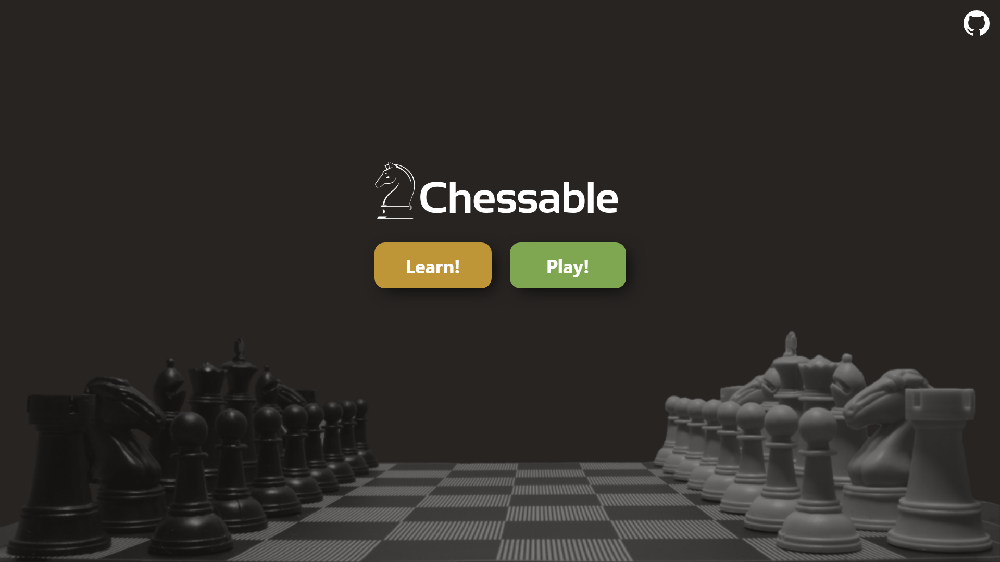
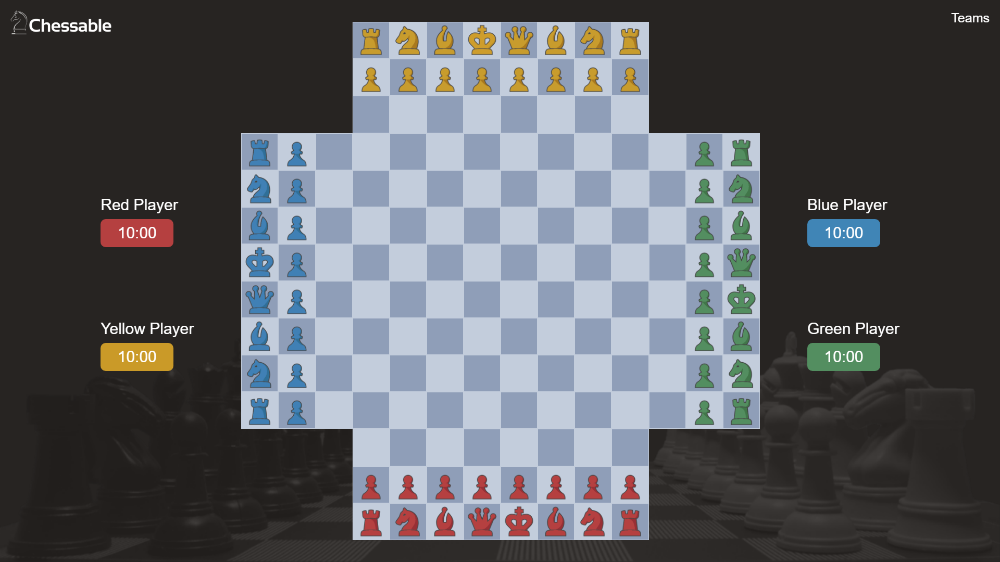

# Chessable - A Web based Chess game!

This project is built with a simple approach to enhance our web development skills and logic
building. Of course there are many aspects in this project where improvisation will be implemented
with time. Keeping that in mind, we have tried our best to deliver a functional and user-friendly
website that meets the project requirements.  
Liscence - MIT License. Copyright (c) 2023 Prathmesh Kale.  

https://prathmesh-ka-github.github.io/Chessable/

## Tech Stack and Tools - 
- Vanilla HTML5.
- Vanilla CSS3.
- Javascript.
- JQuery.
- Figma.
- Microsoft's Visual Studio Code.

## Abstract
 It is a hassle to carry a chess board and all the pieces wherever you travel, that is, the
 physical board game is not portable. Traditional chess is played between 2 players so there is no
 room for more players to play together on the same board. The majority of people are not aware of
 any alternative version of chess. Even though chess has simple rules and piece movements, many
 people tend to use the excuse of “Chess is hard to learn”.  

The quick fix of these problems can be done by several means. Making the game portable
and easy to access can create a large response from the audience and make active participation
possible. Another course of action to fascinate a crowd is, making a chess game which can be
played by more than 2 players at a time on the same board. The participation of many players does
not only make it competitive but also interesting . Last but not the least, for making it far-reaching,
a user-friendly UI can be created which provides hints and help for users to make the game easier
to understand and play, even for beginners.  

Therefore, we have created a browser based Chess game which one can play at the click of
their mouse. On top of that, we will be implementing a chess variant which will have the same rules, regulations and pieces behaviour but which would be played by 4 players. The 4-player chess variant(Inspired by Chaturang.) is not played much due to lack of awareness. This idea is actually to overcome the fact that the original game was played between 2 players only, and our approach is mainly to promote
playing chess with friends and family, spending time together, thinking intuitively and hence doing
something productive and fun at the same time.  

### Four player chess variant -   
inspired by Chaturang*  

As for the technical standpoint, this game is built using HTML,CSS,Javascript and JQuery.
And the model which is used to build Chessable is an Iterative model.  
Definition- According to D. B. Pritchard, Four-player chess "is generally understood to be a
game played with two sets on a standard board with four extensions, one on each side, usually of
8x3 squares (arguably the best arrangement) but sometimes 8x2 or 8x4, on which the pieces are set
up in the normal array positions."  

 Chessable will help encourage playing chess among young minds and also increase
 awareness about chess variations as only few know about it, which in turn improve cognitive skills,
 visualisation skills, pattern detection, planning, concentration ability, decision making skills,
 strategic analysis, creative thinking, focus, patience, resilience and the biggest one so far is problem
 solving skills

## Purpose/objective and goals
1. To add more challenges to the existing game.
2. To add new features on top of the originalclassical chess.(themes)
3. To make the game more appealing,interestingand fun to play.
4. To appeal the game to a wider audience.
5. To experiment on the existing game design andlayout.
6. Toimprove cognitive skills, visualisation skills, pattern detection, planning, concentration ability, decision making skills, strategic analysis, creative thinking, focus, patience, resilience and the biggest one so far is problem solving skills

## System Requirements -
- ### Operating System
    - Windows 10.
    - Windows 8, 8-1.
    - Windows 7.
    - Windows vista.
    - Windows server 2008 and later.
    - Linux.
    - Unix.
    - Mac.
- ### Hardware Environment -
    - Processor: x86 or x64.
    - RAM : 512 MB (minimum), 1 GB (recommended).
    - Hard disc: up to 3 GB of free space may be required.  
- ### Web Browser -
    - Internet Explorer 6+
    - Microsoft Edge 121+
    - Chrome 8+
    - Safari 3+
    - Opera 11+
    - Mozilla Firefox 2.0+